# Estruturas em Árvores Avançadas

[](https://github.com/KairoHenrique)
[](https://www.python.org/)
[](https://github.com/KairoHenrique/TP1-Estruturas-em-Arvores-Avancadas)
[](https://github.com/KairoHenrique)
[](https://github.com/KairoHenrique)

## Introdução

Árvores binárias de busca (BST) e árvores AVL resolvem o dicionário clássico sobre um universo **totalmente ordenado**. Na prática, porém, o dado nem sempre é um inteiro isolado: conjuntos de strings compartilham prefixos, sequências de acesso exibem localidade temporal e aplicações geométricas consultam vizinhança em R^k. Nesses recortes, BST e AVL são corretas, mas não exploram a estrutura da chave.

Este trabalho implementa, visualiza e compara **cinco estruturas hierárquicas especializadas** — Trie, Patricia (radix compacta), Splay, Treap e KD-Tree — com baselines BST e AVL só no grupo de chaves ordenáveis.

## Descrição do projeto

Cada estrutura foi estudada e implementada com as operações fundamentais (inserção, busca, remoção) e, quando couber, operação específica. O repositório integra:

1. **Fundamentação e invariantes** de cada árvore, contrastadas com BST/AVL.
2. **Código modular em Python**, instrumentado (`comparações`, `rotações`, nós, tempo).
3. **Rastreamento visual** em três estados por estrutura (inserção, mecanismo típico, remoção).
4. **Experimentos** em três universos de chave que **não são misturáveis**.
5. **Relatório comparativo** consolidando teoria, implementação e medição.

Trabalho Prático Individual I da disciplina *Algoritmos e Estruturas de Dados II*.

### Estruturas implementadas

| Estrutura | Universo | Operação específica | Invariante |
|-----------|----------|---------------------|------------|
| **Trie** | strings | `starts_with` / listar por prefixo | um caractere por aresta; marca de fim de palavra |
| **Patricia** | strings | busca/enumeração por prefixo compacto | arestas com *strings*; split no mismatch |
| **Splay** | chaves ordenáveis | splay (zig / zig-zig / zig-zag) | BST; item acessado sobe à raiz |
| **Treap** | chaves ordenáveis | prioridade aleatória + rotações | BST nas chaves e heap nas prioridades |
| **KD-Tree** | pontos k-D | vizinho mais próximo e range 2D | eixo alternado; partição espacial |
| **BST / AVL** | chaves ordenáveis | — / fator de balanceamento | baseline da Seção 4 e 5 do enunciado |

### Três grupos experimentais

As estruturas **não competem no mesmo tipo de dado**. A bateria respeita isso:

| Grupo | Quem entra | O que se mede |
|-------|------------|---------------|
| Strings | Trie vs Patricia | inserção, busca, prefixo, nós, memória |
| Ordenáveis | Splay, Treap, BST, AVL | aleatório, ordenado, Zipf, localidade |
| Espacial | KD-Tree vs força bruta | NN 2D/3D e range query |

n em {1000, 5000, 10000}, semente `20260919`.

## Estrutura geral do projeto

Cada pasta tem **um papel claro**: código em `src/`, figuras didáticas em `output/figures/` e medição em `experiments/`.

```
TP1-Estruturas-em-Arvores-Avancadas/
├── README.md
├── requirements.txt
├── src/
│   ├── common/metrics.py          # comparações, rotações, nós, cronômetro
│   ├── trie/trie.py
│   ├── patricia/patricia.py
│   ├── splay/splay.py
│   ├── treap/treap.py
│   ├── kdtree/kdtree.py
│   └── baselines/                 # BST e AVL (só comparação)
├── visualization/                 # DOT + PNG das árvores; plot 2D da KD-Tree
├── demos/                         # três estados visuais por estrutura
│   └── run_all_demos.py
├── experiments/
│   ├── sanity.py                  # corretude (insert/search/delete)
│   ├── datasets.py
│   ├── runner.py                  # bateria → CSV + gráficos
│   └── plots.py
├── output/
│   ├── figures/                   # PNGs e DOTs dos demos
│   └── experiments/               # resultados.csv + gráficos matplotlib
```

## Implementação

O fluxo do repositório é uma pipeline de **estudo → código → visualização → medição**:

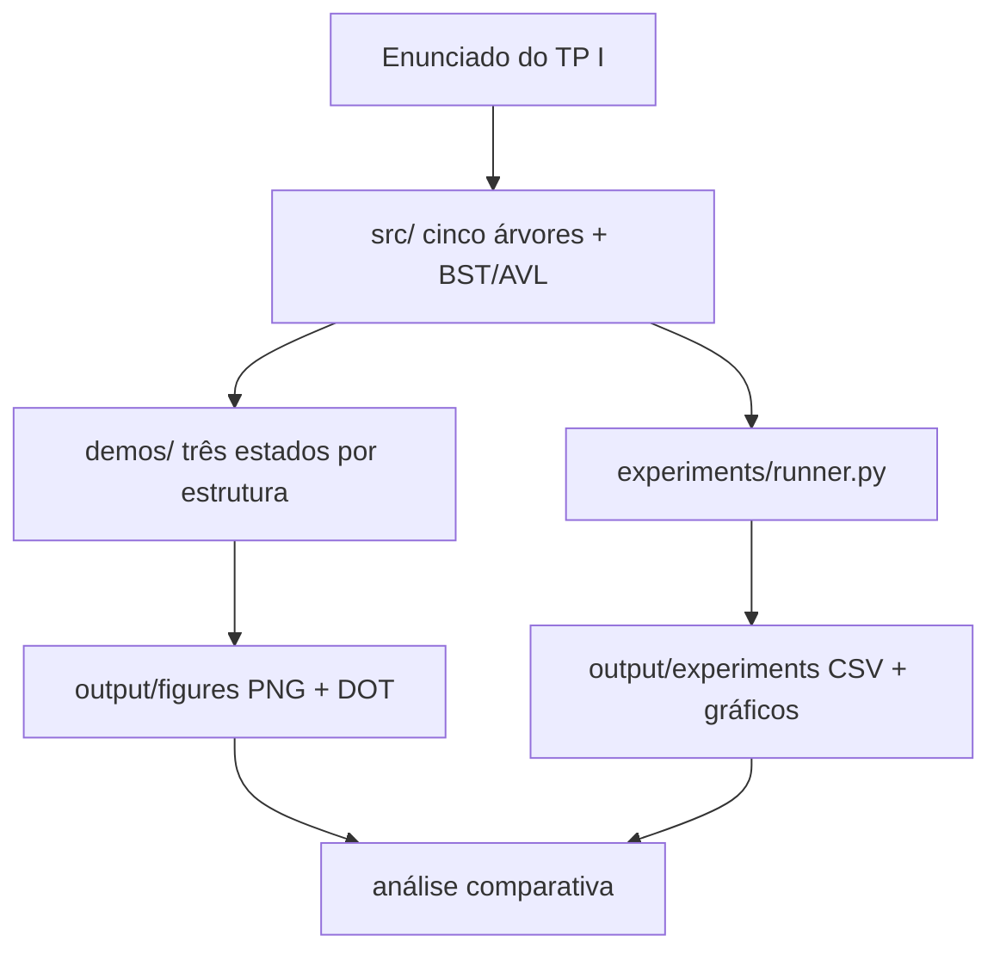

**O que cada módulo faz, em detalhe:**

1. **Trie** — um caractere por aresta; inserção cria o caminho; remoção desmarca o terminal e poda ramos inúteis; `words_with_prefix` enumera o subconjunto.
2. **Patricia** — radix compacta: rótulo de aresta é uma *string*. Inserção calcula o prefixo comum e **divide** a aresta no primeiro mismatch; remoção pode **recompactar** um caminho unário.
3. **Splay** — splay bottom-up recursivo. Inserção splaya e recorta a árvore na nova raiz. Remoção splaya o alvo e junta a subárvore esquerda (máximo) com a direita.
4. **Treap** — inserção BST seguida de rotações enquanto a prioridade do filho viola o heap máximo. Remoção rotaciona o nó para baixo até extrai-lo. RNG com semente **só** nos experimentos.
5. **KD-Tree** — inserção pelo eixo `depth mod k`; NN com poda da bola; range com poda por intervalo; remoção pelo mínimo da dimensão de corte (Bentley). Plot 2D dos hiperplanos em `visualization/kd_plot.py`.
6. **Métricas** — objeto `Metrics` injetado (sem globais): comparações, rotações, nós criados/removidos e `perf_counter`.

API uniforme: `insert`, `search`, `delete`, `to_dot()`, mais a operação específica de cada árvore.

## Demonstração e rastreamento visual

Os exemplos são pequenos de propósito: cada figura isola **um** mecanismo. Círculos duplos marcam fim de palavra. Figuras geradas por `python demos/run_all_demos.py` (matplotlib a partir do DOT exportado pela própria estrutura — **não** são imagens sintéticas de modelo generativo).

### Trie — compartilhamento de prefixo

`casa`, `caso`, `cama`, `carro` compartilham `c-a`. A Trie **não** compacta o caminho `c-a-s-a`.

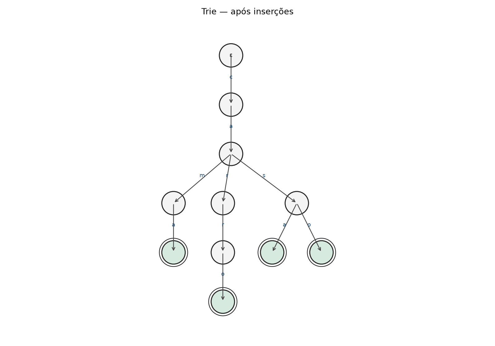

`cardapio` e `carta` aprofundam o ramo `c-a-r`:

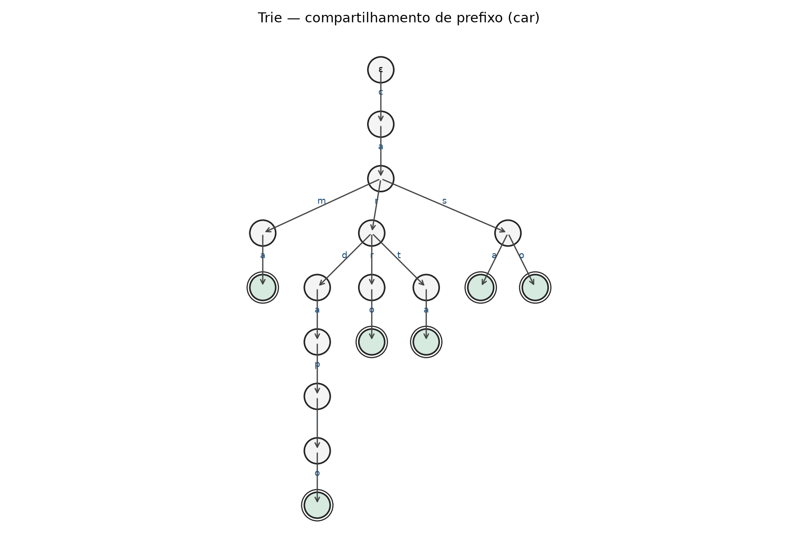

### Patricia — split de prefixo

Inserir `casa` e depois `caso` força o split em aresta `cas` + ramos `a` e `o`. Esse é o ponto que a Trie não mostra.

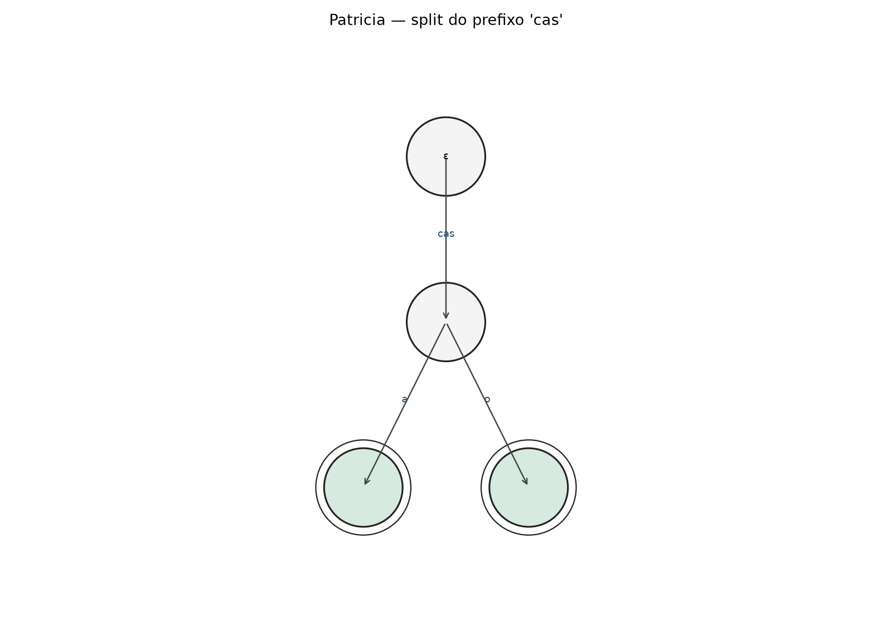

Novas chaves compactam e redividem (`ca` + `s` / `m` / `rro`):

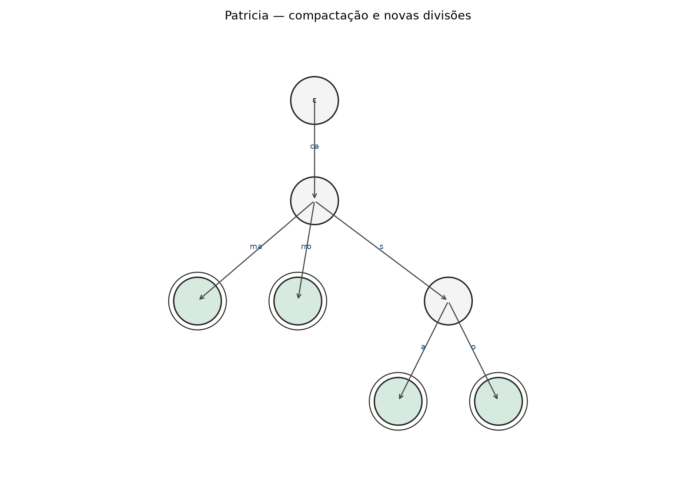

### Splay — o acessado vai à raiz

Inserções `10, 20, 30, 40, 50` deixam o último valor na raiz. A busca de `10` aplica zig-zig na cadeia e coloca `10` no topo.

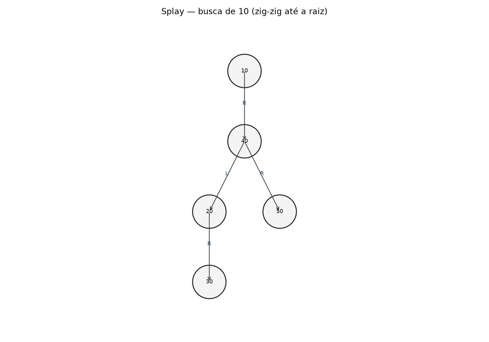

### Treap — prioridade alta sobe

`25` entra com prioridade 0,90 e sobe à raiz **sem** quebrar a ordem BST das chaves.

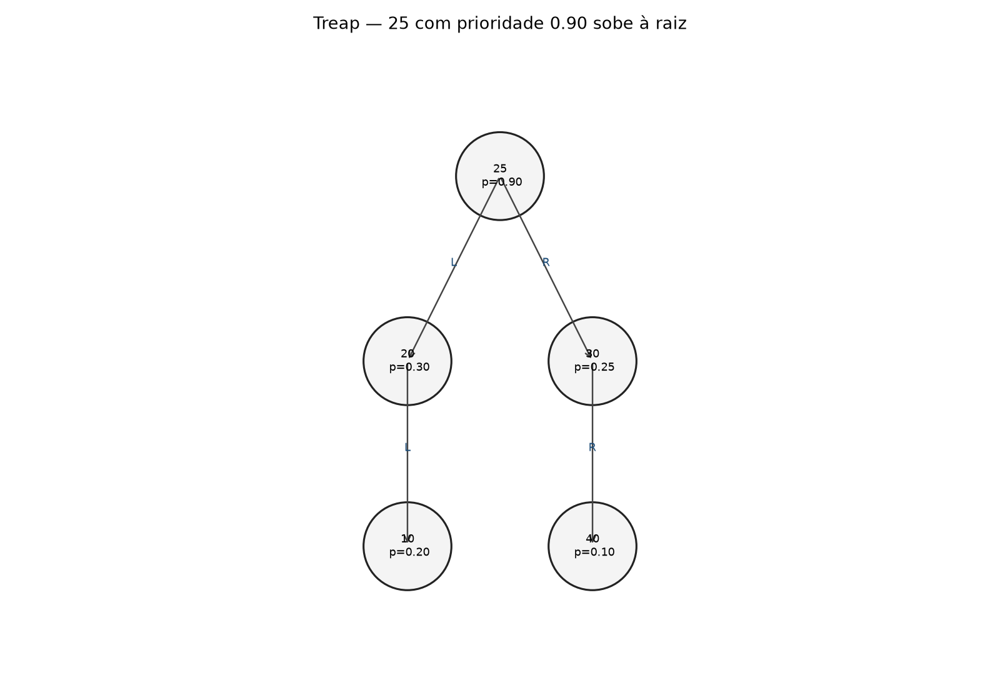

### KD-Tree — partição espacial e vizinho mais próximo

Cortes verticais/horizontais alternados no plano. Depois da remoção de `(8, 3)`, a consulta `(6,5 ; 7,5)` encontra `(7, 8)`.

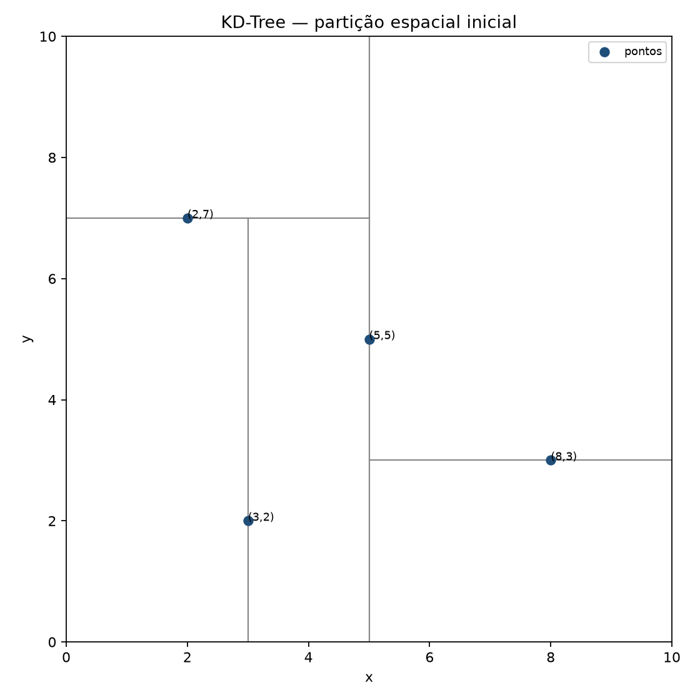

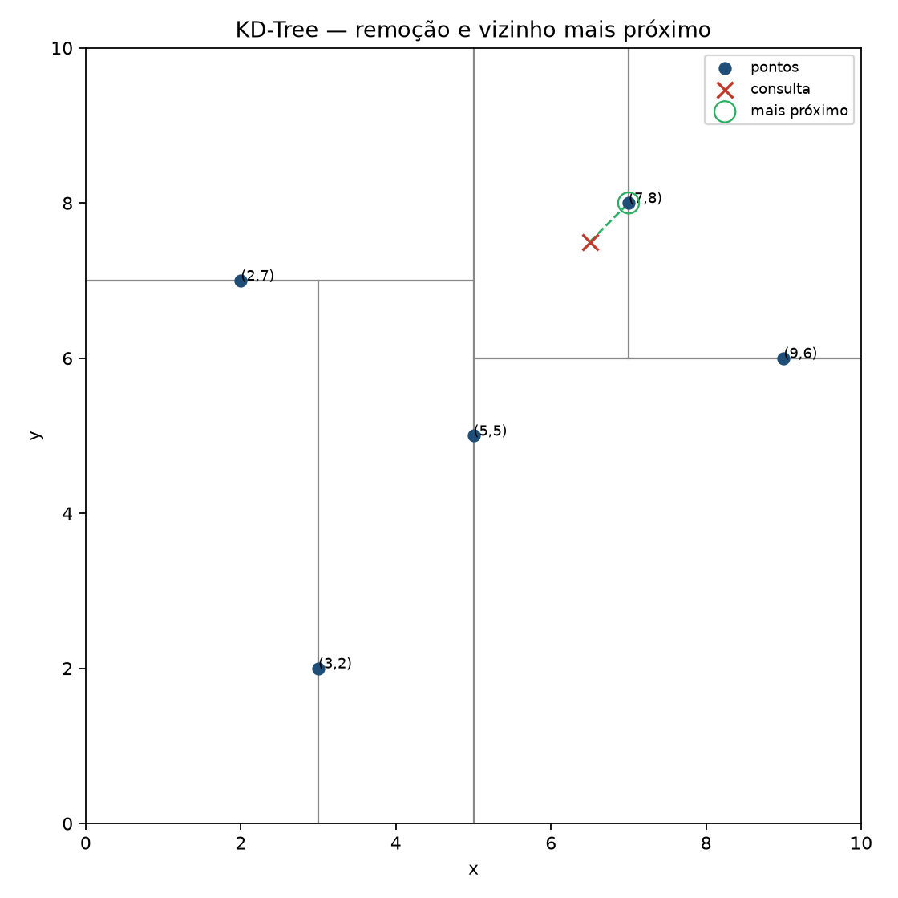

Demais estados (remoção da Trie/Patricia/Splay/Treap e diagramas em árvore da KD-Tree) estão em `output/figures/<estrutura>/`.

## Experimentos e resultados

Instrumentação com `time.perf_counter` + contadores internos. Valores de [`output/experiments/resultados.csv`](output/experiments/resultados.csv), semente `20260919`. Regenerar com `python experiments/runner.py`.

> BST e Splay com inserção **ordenada** em n = 10.000 foram omitidas: a árvore degenera, o Θ(n²) e a profundidade de recursão distorcem a escala sem acrescentar informação além de n = 5.000.

### Grupo strings — Trie vs Patricia

Palavras sintéticas com prefixos compartilhados (`pre`, `pro`, `par`, … + sufixo aleatório).

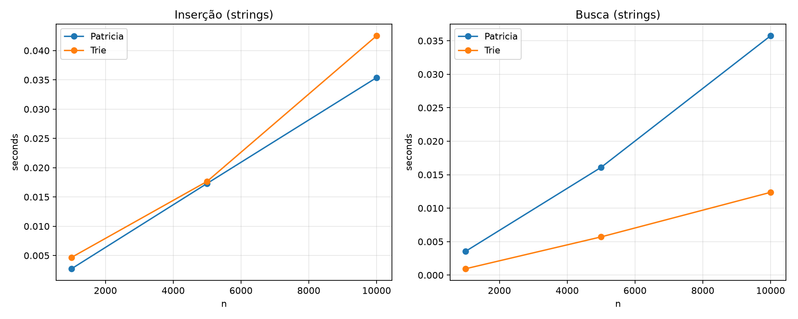

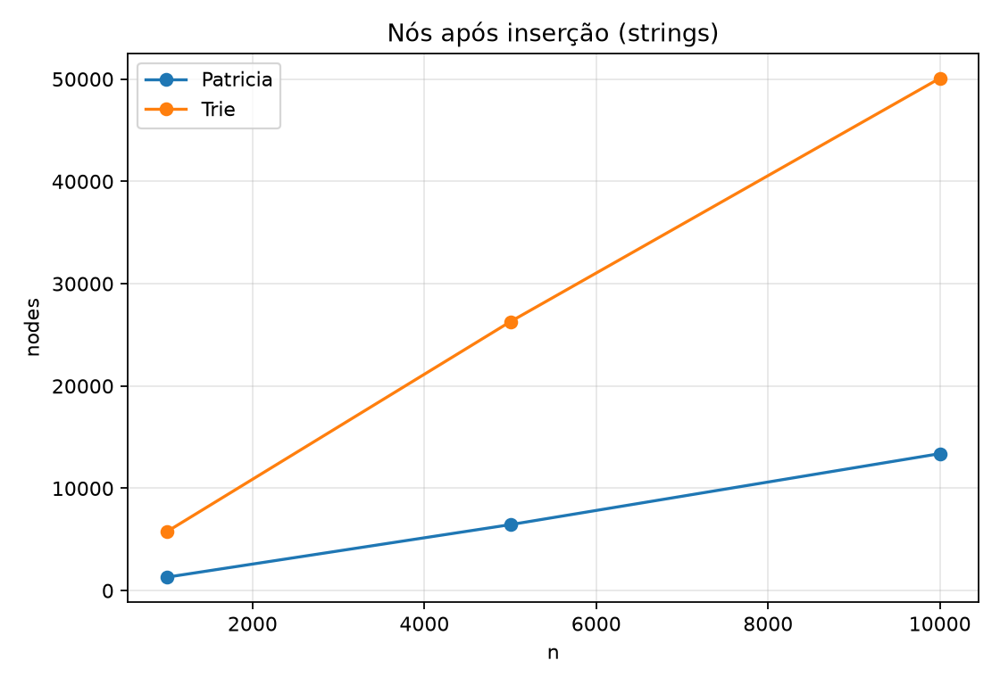

| n | Trie (nós) | Patricia (nós) | Trie insert | Patricia insert | Trie search | Patricia search |
|----:|----------:|---------------:|------------:|----------------:|------------:|----------------:|
| 1 000 | 5 754 | 1 312 | 0,005 s | 0,003 s | 0,001 s | 0,004 s |
| 5 000 | 26 288 | 6 450 | 0,018 s | 0,017 s | 0,006 s | 0,016 s |
| 10 000 | **50 087** | **13 391** | 0,043 s | 0,035 s | 0,012 s | 0,036 s |

**Discussão.** Em n = 10.000 a Patricia usa cerca de **3,7× menos nós** (memória estimada 2,6 MB vs 10,5 MB). A inserção fica na mesma ordem O(nL). A busca da Patricia é *mais lenta*: cada nível compara um rótulo inteiro. Isso confirma a análise: ganho **espacial**, não assintótico em tempo.

### Grupo ordenável — Splay, Treap, BST, AVL

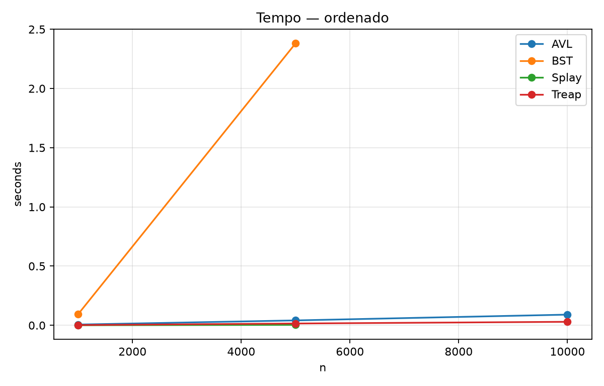

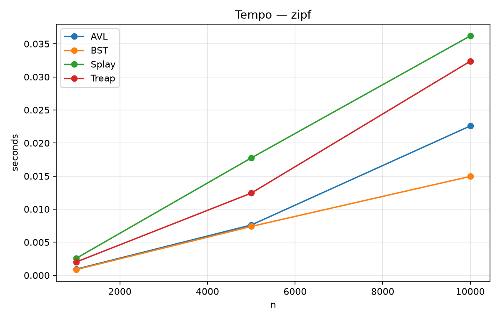

Inserção **aleatória**, n = 10.000:

| Estrutura | Tempo | Rotações | Leitura |
|-----------|------:|---------:|---------|
| BST | 0,042 s | 0 | barata porque não rebalanceia |
| Treap | 0,055 s | 20 293 | heap nas prioridades |
| Splay | 0,086 s | 193 320 | paga cada acesso com rotação |
| AVL | 0,100 s | 6 956 | pior caso rígido O(log n) |

Inserção **ordenada**, n = 5.000: BST **2,58 s** e **25 milhões** de comparações (Θ(n²)); AVL 0,041 s; Treap 0,015 s. A Splay *insere* em 0,004 s (cada novo máximo vira raiz em O(1)), mas a busca seguinte custa 0,040 s.

Busca Zipf vs uniforme na Splay (n = 10.000): **0,036 s / 171 k comparações** contra **0,074 s / 333 k**. Localidade reduz trabalho, como o modelo amortizado prevê.

### Grupo espacial — KD-Tree vs força bruta

400 consultas de vizinho mais próximo.

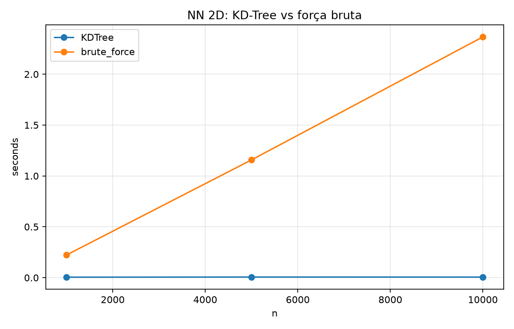

| n | KD-Tree 2D | Força bruta 2D | KD-Tree 3D | Força bruta 3D |
|----:|-----------:|---------------:|-----------:|---------------:|
| 1 000 | 0,005 s | 0,26 s | 0,005 s | 0,33 s |
| 5 000 | 0,006 s | 1,34 s | 0,007 s | 1,67 s |
| 10 000 | **0,006 s** | **3,50 s** | 0,014 s | 4,01 s |

**Discussão.** Em 2D, n = 10.000, a KD-Tree sai cerca de **580×** mais rápida que a varredura linear. Em 3D o gap permanece, um pouco menor em vantagem relativa — coerente com a perda de poda quando k cresce. A construção é incremental (não mediana); mesmo assim a poda funcionou neste conjunto uniforme.

## Análise assintótica

Sejam n o número de chaves, L o comprimento da string, k a dimensão e m o número de pontos reportados numa range query. “Esperado” refere-se a prioridade/ordem aleatória.

| Operação | Trie | Patricia | Splay | Treap | KD-Tree | BST | AVL |
|----------|------|----------|-------|-------|---------|-----|-----|
| Busca (médio) | O(L) | O(L) | O(log n) amort. | O(log n) esp. | O(n^(1-1/k)) típico | O(log n) | O(log n) |
| Busca (pior) | O(L) | O(L) | O(n) | O(n) | O(n) | O(n) | O(log n) |
| Inserção (médio) | O(L) | O(L) | O(log n) amort. | O(log n) esp. | O(log n) típico | O(log n) | O(log n) |
| Inserção (pior) | O(L) | O(L) | O(n) | O(n) | O(n) | O(n) | O(log n) |
| Remoção (médio) | O(L) | O(L) | O(log n) amort. | O(log n) esp. | O(log n) típico | O(log n) | O(log n) |
| Remoção (pior) | O(L) | O(L) | O(n) | O(n) | O(n) | O(n) | O(log n) |
| Construção | O(nL) | O(nL) | O(n log n) amort. | O(n log n) esp. | O(n log n) méd. | O(n log n) méd. | O(n log n) |
| Específica | prefixo O(L+m) | prefixo O(L+m) | splay O(altura) | — | NN / range | — | rotação O(1) |
| Espaço | O(nL) pior | O(n) nós típico | O(n) | O(n) | O(n) | O(n) | O(n) |

**Por que esses custos.** Trie: um símbolo, uma descida. Patricia: ainda O(L) em caracteres, porém **menos nós**. Splay: sem limite de altura; o potencial de Sleator–Tarjan dá O(log n) amortizado. Treap: mesma distribuição de uma BST aleatória. KD-Tree: NN melhor que linear no caso típico 2D; degenera em Θ(n) em configurações patológicas. BST degenera na inserção ordenada; AVL restaura \|hL − hR\| ≤ 1 com O(1) rotações por inserção.

Nenhuma estrutura **domina**. Prefixo de strings → Patricia (espaço) ou Trie (simplicidade). Pior caso rígido → AVL. Carga enviesada → Splay. Balanceamento probabilístico simples → Treap. Pontos em R² / R³ → KD-Tree.

## Análise e conclusões

- Trie e Patricia exploram **prefixos**; Splay, o **histórico de acesso**; Treap, a **aleatoriedade**; KD-Tree, a **geometria**. BST/AVL exploram ordem total unidimensional.
- Onde o modelo assintótico distingue pior e médio (BST vs AVL, brute force vs KD-Tree), o experimento reproduz a folga. Onde só mudam constantes (Trie vs Patricia em O(L)), o gráfico de **nós** informa mais que o de tempo.
- Patricia (split no meio da aresta + compactação) e KD-Tree (remoção + poda de NN) exigiram mais cuidado de corretude; Trie e Treap, menos.
- `sys.getsizeof` nos nós é **comparativo**, não absoluto: subestima objetos aninhados do interpretador.
- Melhorias naturais: KD-Tree reconstruída pelo mediano; Patricia bit a bit; treap implícita; alfabeto compacto na Trie ASCII.

## Instalação e configuração

**Pré-requisitos:** Python 3.12+ e as bibliotecas de `requirements.txt`. Opcional: [Graphviz](https://graphviz.org/download/) no sistema (`dot`) para renderizar PNG via binário; sem ele, as árvores saem em matplotlib a partir do DOT.

```bash
# 1. Clonar o repositório
git clone https://github.com/KairoHenrique/TP1-Estruturas-em-Arvores-Avancadas.git
cd TP1-Estruturas-em-Arvores-Avancadas

# 2. Dependências
pip install -r requirements.txt

# 3. Corretude
python experiments/sanity.py

# 4. Figuras didáticas (três estados por estrutura)
python demos/run_all_demos.py

# 5. Bateria experimental (CSV + gráficos)
python experiments/runner.py
```

### Teste rápido (checklist)

| Passo | Comando / arquivo | Resultado esperado |
|-------|-------------------|--------------------|
| Dependências | `pip install -r requirements.txt` | `matplotlib` (e `graphviz` opcional) |
| Sanity | `python experiments/sanity.py` | `Sanity: todas as estruturas passaram.` |
| Demos | `python demos/run_all_demos.py` | PNGs em `output/figures/` |
| Experimentos | `python experiments/runner.py` | `output/experiments/resultados.csv` + gráficos |

**Saídas** (regeneradas a cada execução; exemplos já versionados):

- `output/figures/<estrutura>/*.png` — rastreamento visual
- `output/figures/<estrutura>/*.dot` — fonte Graphviz
- `output/experiments/resultados.csv` — tempos, comparações, rotações, nós
- `output/experiments/*.png` — gráficos da Seção 5

## Ambiente de teste

- **Processador:** AMD Ryzen 7 5700X (8 núcleos / 16 *threads*)
- **Memória RAM:** 32 GB
- **Sistema operacional:** Microsoft Windows 11 Pro (build 26200)
- **Interpretador:** Python 3.12.10
- **Medição:** `time.perf_counter`, semente `20260919`, uma corrida completa da bateria (~24 s neste ambiente)

> Execuções isoladas variam com processos em segundo plano; os valores do CSV são a referência deste repositório. Rode `python experiments/runner.py` de novo para reproduzir na sua máquina.

## Recursos utilizados

`Python 3.12` · `matplotlib` · DOT / Graphviz (opcional) · `Visual Studio Code` / Cursor

Literatura de apoio (detalhada no relatório): Cormen et al.; Sleator & Tarjan (Splay, 1985); Seidel & Aragon (Treap, 1996); Bentley (KD-Tree, 1975); Morrison (Patricia, 1968); Sedgewick & Wayne (Tries).

## Autor

Trabalho **individual** desenvolvido para a disciplina de AEDS II.

| |
|---|
| [](https://github.com/KairoHenrique) |
| **Kairo Henrique Ferreira Martins** |
| [github.com/KairoHenrique](https://github.com/KairoHenrique) |
