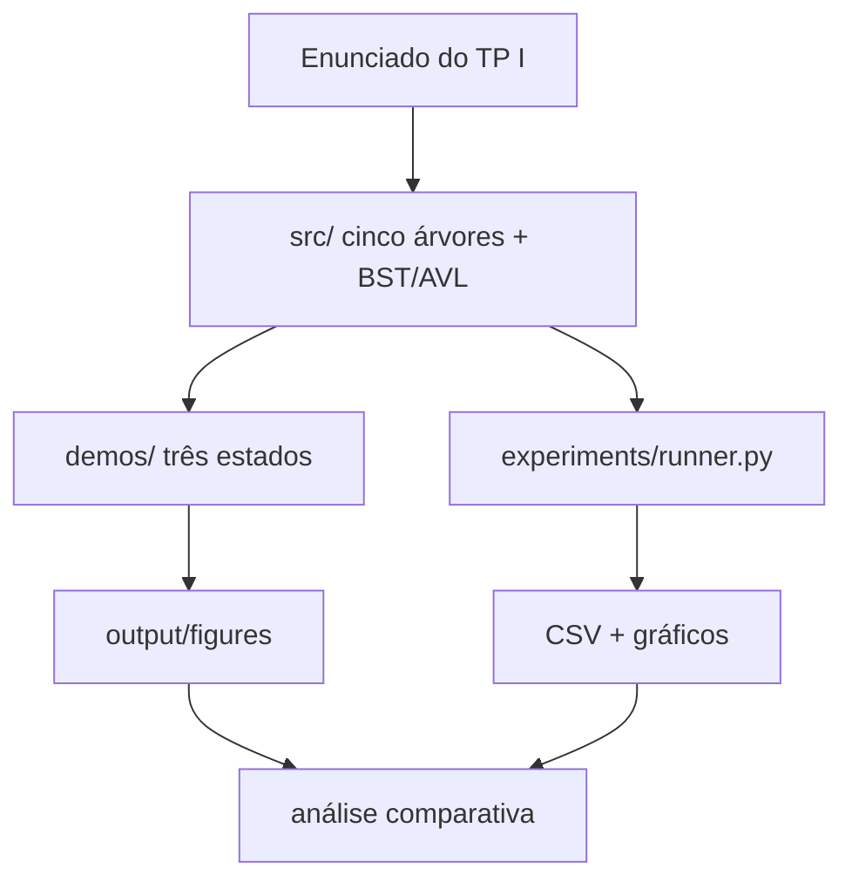

# Estruturas em Árvores Avançadas

[](https://github.com/KairoHenrique/TP1-Estruturas-em-Arvores-Avancadas)
[](https://www.python.org/)
[](https://github.com/KairoHenrique/TP1-Estruturas-em-Arvores-Avancadas)
[](https://github.com/KairoHenrique)
[](report/Relatorio.pdf)
[](https://github.com/KairoHenrique)

Relatório técnico (8–12 páginas): [`report/Relatorio.pdf`](report/Relatorio.pdf).

## Introdução

BST e AVL resolvem o dicionário clássico sobre um universo **totalmente ordenado**. Na prática o dado nem sempre é um inteiro isolado: strings compartilham prefixos, acessos têm localidade temporal e consultas geométricas pedem vizinhança em R^k. Nesses recortes, BST e AVL são corretas, mas não exploram a estrutura da chave.

Este trabalho implementa, visualiza e compara **cinco árvores especializadas** — Trie, Patricia (radix compacta), Splay, Treap e KD-Tree — com baselines BST e AVL só no grupo de chaves ordenáveis.

## Descrição do projeto

Trabalho Prático Individual I de *Algoritmos e Estruturas de Dados II*. Cada estrutura tem inserção, busca, remoção e, quando couber, operação específica.

1. Fundamentação e invariantes, contrastadas com BST/AVL.
2. Código modular em Python, instrumentado (comparações, rotações, nós, tempo).
3. Três estados visuais por estrutura, gerados pelo próprio `to_dot()`.
4. Experimentos em **três universos de chave** que não são misturáveis.
5. Relatório comparativo em [`report/Relatorio.pdf`](report/Relatorio.pdf).

### Estruturas implementadas

| Estrutura | Universo | Operação específica | Invariante |
|-----------|----------|---------------------|------------|
| **Trie** | strings | `starts_with` / listar por prefixo | um caractere por aresta; marca de fim de palavra |
| **Patricia** | strings | busca e enumeração por prefixo compacto | aresta com *string*; split no mismatch |
| **Splay** | chaves ordenáveis | splay (zig / zig-zig / zig-zag) | BST; o item acessado sobe à raiz |
| **Treap** | chaves ordenáveis | prioridade aleatória + rotações | BST nas chaves e heap nas prioridades |
| **KD-Tree** | pontos k-D | vizinho mais próximo e range | eixo alternado; partição espacial |
| **BST** | chaves ordenáveis | — | ordem simétrica; sem rebalanceamento |
| **AVL** | chaves ordenáveis | fator de balanceamento | alturas das subárvores diferem no máximo 1 |

### Três grupos experimentais

| Grupo | Quem entra | O que se mede |
|-------|------------|---------------|
| Strings | Trie vs Patricia | inserção, busca, prefixo, remoção, nós, memória |
| Ordenáveis | Splay, Treap, BST, AVL | aleatório, ordenado, Zipf, localidade |
| Espacial | KD-Tree vs força bruta | inserção, NN 2D/3D, range e remoção |

n em {1000, 5000, 10000}, semente `20260919`.

## Estrutura geral do projeto

Cada pasta tem um papel claro: código em `src/`, figuras didáticas em `output/figures/`, medição em `experiments/` e o PDF em `report/`.

```
TP1-Estruturas-em-Arvores-Avancadas/
├── README.md
├── requirements.txt
├── run.sh                         # sanity + demos + experimentos (Linux)
├── src/
│   ├── common/
│   │   ├── metrics.py             # comparações, rotações, nós, cronômetro
│   │   └── mpl_backend.py         # matplotlib Agg (sem display)
│   ├── trie/trie.py
│   ├── patricia/patricia.py
│   ├── splay/splay.py
│   ├── treap/treap.py
│   ├── kdtree/kdtree.py
│   └── baselines/                 # BST e AVL (só comparação)
├── visualization/                 # DOT → PNG; plot 2D da KD-Tree
├── demos/                         # três estados visuais por estrutura
│   └── run_all_demos.py
├── experiments/
│   ├── sanity.py                  # corretude (insert/search/delete)
│   ├── datasets.py
│   ├── runner.py                  # bateria → CSV + gráficos
│   └── plots.py
├── output/
│   ├── figures/                   # PNGs e DOTs dos demos
│   └── experiments/               # resultados.csv + gráficos
└── report/
    └── Relatorio.pdf
```



API uniforme: `insert`, `search`, `delete`, `to_dot()`, mais a operação específica de cada árvore. Métricas vêm de um objeto `Metrics` injetado (sem globais).

## Implementação

1. **Trie** — um caractere por aresta; remoção desmarca o terminal e poda ramos inúteis; `words_with_prefix` enumera o subconjunto.
2. **Patricia** — rótulo da aresta é uma *string*. Inserção **divide** no mismatch; remoção pode **recompactar** caminho unário.
3. **Splay** — bottom-up. Inserção splaya e recorta na nova raiz. Remoção splaya o alvo e junta a subárvore esquerda (máximo) com a direita.
4. **Treap** — inserção BST + rotações até o heap máximo. Remoção rotaciona o nó até extraí-lo. RNG com semente **só** nos experimentos.
5. **KD-Tree** — eixo `depth mod k`; NN com poda da bola; range com poda por intervalo; remoção pelo mínimo da dimensão de corte.

## Demonstração visual

Exemplos pequenos: cada figura isola **um** mecanismo. Círculos duplos marcam fim de palavra. Geradas por `python3 demos/run_all_demos.py` a partir do DOT da própria estrutura — não são imagens sintéticas.

### Trie — prefixo compartilhado

`casa`, `caso`, `cama`, `carro` compartilham `c-a`. A Trie **não** compacta `c-a-s-a`.


`cardapio` e `carta` aprofundam o ramo `c-a-r`:


### Patricia — split

Inserir `caso` sobre `casa` divide a aresta em `cas` + ramos `a` e `o`.


Novas chaves redividem (`ca` + `s` / `m` / `rro`):


### Splay — o acessado vai à raiz

Inserções `10, 20, 30, 40, 50` deixam o último valor na raiz. A busca de `10` aplica zig-zig e coloca `10` no topo.


### Treap — prioridade alta sobe

`25` entra com prioridade 0,90 e sobe à raiz **sem** quebrar a ordem BST.


### KD-Tree — partição e vizinho mais próximo

Cortes verticais e horizontais. Depois de remover `(8, 3)`, a consulta `(6,5; 7,5)` encontra `(7, 8)`.


Os demais estados (remoção da Trie/Patricia/Splay/Treap e a árvore da KD-Tree) estão em `output/figures/<estrutura>/`.

## Experimentos e resultados

Fonte: [`output/experiments/resultados.csv`](output/experiments/resultados.csv). Semente `20260919`. Tempos com `time.perf_counter` no desktop (seção Ambiente). Regenerar: `python3 experiments/runner.py`.

> BST e Splay com inserção **ordenada** em n = 10.000 foram omitidas: a degeneração Θ(n²) e a profundidade de recursão distorcem a escala; n = 5.000 já demonstra o colapso.

### Grupo strings — Trie vs Patricia

Palavras com prefixos compartilhados (`pre`, `pro`, `par`, … + sufixo). Mede inserção, busca, prefixo e remoção de n/5 palavras.


| n | Trie (nós) | Patricia (nós) | Trie insert | Patricia insert | Trie search | Patricia search |
|----:|----------:|---------------:|------------:|----------------:|------------:|----------------:|
| 1 000 | 5 754 | 1 312 | 0,004 s | 0,002 s | 0,001 s | 0,003 s |
| 5 000 | 26 288 | 6 450 | 0,014 s | 0,014 s | 0,005 s | 0,014 s |
| 10 000 | **50 087** | **13 391** | 0,033 s | 0,024 s | 0,010 s | 0,030 s |

Em n = 10.000 a Patricia usa cerca de **3,7× menos nós** (memória estimada 2,5 MB vs 10,0 MB). A inserção fica na mesma ordem O(nL). A busca da Patricia é *mais lenta*: cada nível compara um rótulo inteiro. Ganho **espacial**, não assintótico em tempo.

Remoção de n/5 palavras, n = 10.000: Trie **0,005 s**; Patricia **4,84 s**. A compactação após cada delete reconstrói caminhos unários e vira o custo dominante — o espaço menor não sai de graça na remoção.

### Grupo ordenável — Splay, Treap, BST, AVL


Inserção **aleatória**, n = 10.000:

| Estrutura | Tempo | Rotações | Leitura |
|-----------|------:|---------:|---------|
| BST | 0,041 s | 0 | barata porque não rebalanceia |
| Treap | 0,051 s | 20 293 | heap nas prioridades |
| Splay | 0,081 s | 193 320 | paga cada acesso com rotação |
| AVL | 0,089 s | 6 956 | pior caso rígido O(log n) |

Inserção **ordenada**, n = 5.000: BST **2,38 s** e **25 milhões** de comparações (Θ(n²)); AVL 0,041 s; Treap 0,015 s. A Splay *insere* em 0,004 s (cada novo máximo vira raiz em O(1)), mas a busca seguinte custa 0,035 s.

Busca Zipf vs uniforme na Splay (n = 10.000): **0,033 s / 171 k comparações** contra **0,067 s / 333 k**. Localidade reduz trabalho, como o modelo amortizado prevê.

### Grupo espacial — KD-Tree vs força bruta

400 consultas de vizinho mais próximo.


| n | KD-Tree 2D | Força bruta 2D | KD-Tree 3D | Força bruta 3D |
|----:|-----------:|---------------:|-----------:|---------------:|
| 1 000 | 0,005 s | 0,22 s | 0,006 s | 0,27 s |
| 5 000 | 0,006 s | 1,16 s | 0,006 s | 1,38 s |
| 10 000 | **0,006 s** | **2,37 s** | 0,007 s | 2,72 s |

Em 2D, n = 10.000, a KD-Tree fica cerca de **420×** mais rápida que a varredura linear. Em 3D o gap permanece, um pouco menor em vantagem relativa — coerente com a perda de poda quando k cresce. A árvore é incremental (não reconstruída pelo mediano).

## Análise assintótica

n = número de chaves, L = comprimento da string, k = dimensão, m = pontos reportados numa range query. “Esperado” = prioridade ou ordem aleatória.

| Operação | Trie | Patricia | Splay | Treap | KD-Tree | BST | AVL |
|----------|------|----------|-------|-------|---------|-----|-----|
| Busca (médio) | O(L) | O(L) | O(log n) amort. | O(log n) esp. | O(n^(1-1/k)) típico | O(log n) | O(log n) |
| Busca (pior) | O(L) | O(L) | O(n) | O(n) | O(n) | O(n) | O(log n) |
| Inserção (médio) | O(L) | O(L) | O(log n) amort. | O(log n) esp. | O(log n) típico | O(log n) | O(log n) |
| Inserção (pior) | O(L) | O(L) | O(n) | O(n) | O(n) | O(n) | O(log n) |
| Remoção (médio) | O(L) | O(L) | O(log n) amort. | O(log n) esp. | O(log n) típico | O(log n) | O(log n) |
| Remoção (pior) | O(L) | O(L) | O(n) | O(n) | O(n) | O(n) | O(log n) |
| Construção | O(nL) | O(nL) | O(n log n) amort. | O(n log n) esp. | O(n log n) méd. | O(n log n) méd. | O(n log n) |
| Específica | prefixo O(L+m) | prefixo O(L+m) | splay O(altura) | heap / rotação | NN / range | — | rotação O(1) |
| Espaço | O(nL) pior | O(n) nós típico | O(n) | O(n) | O(n) | O(n) | O(n) |

Trie: um símbolo, uma descida. Patricia: ainda O(L) em caracteres, com **menos nós**. Splay: sem limite de altura; o potencial de Sleator–Tarjan dá O(log n) amortizado. Treap: mesma distribuição de uma BST aleatória. KD-Tree: NN melhor que linear no 2D típico; degenera em Θ(n) em configurações ruins. BST degenera na inserção ordenada; AVL restaura o fator de altura com O(1) rotações por inserção.

Nenhuma estrutura **domina**. Prefixo de strings → Patricia (espaço) ou Trie (simplicidade). Pior caso rígido → AVL. Carga enviesada → Splay. Balanceamento probabilístico simples → Treap. Pontos em R² / R³ → KD-Tree.

## Conclusões

- Trie e Patricia exploram **prefixos**; Splay, o **histórico**; Treap, a **aleatoriedade**; KD-Tree, a **geometria**. BST/AVL exploram ordem total unidimensional.
- Onde o modelo distingue pior e médio (BST vs AVL, força bruta vs KD-Tree), o experimento reproduz a folga. Onde só mudam constantes (Trie vs Patricia em O(L)), o gráfico de **nós** informa mais que o de tempo.
- Patricia (split/compactação) e KD-Tree (remoção + poda de NN) exigiram mais cuidado; Trie e Treap, menos.
- `sys.getsizeof` nos nós é **comparativo**, não absoluto.

## Instalação e execução

Portátil em **Linux** e Windows (`pathlib`, UTF-8, matplotlib **Agg** — sem tela). No Linux use `python3`.

**Pré-requisitos:** Python 3.10+ e `requirements.txt`. Opcional: Graphviz (`dot`) no sistema; sem ele, as árvores saem em matplotlib.

```bash
git clone https://github.com/KairoHenrique/TP1-Estruturas-em-Arvores-Avancadas.git
cd TP1-Estruturas-em-Arvores-Avancadas

python3 -m pip install -r requirements.txt
# opcional no Ubuntu/Debian: sudo apt install graphviz

python3 experiments/sanity.py
python3 demos/run_all_demos.py
python3 experiments/runner.py

# atalho Linux:
# chmod +x run.sh && ./run.sh
```

| Passo | Comando | Resultado esperado |
|-------|---------|--------------------|
| Dependências | `python3 -m pip install -r requirements.txt` | `matplotlib` |
| Sanity | `python3 experiments/sanity.py` | `Sanity: todas as estruturas passaram.` |
| Demos | `python3 demos/run_all_demos.py` | PNGs em `output/figures/` |
| Experimentos | `python3 experiments/runner.py` | CSV + gráficos em `output/experiments/` |
| Relatório | [`report/Relatorio.pdf`](report/Relatorio.pdf) | artigo 8–12 páginas |

**Saídas** (exemplos já versionados; regeneram a cada execução):

- `output/figures/<estrutura>/*.png` — rastreamento visual
- `output/figures/<estrutura>/*.dot` — fonte Graphviz
- `output/experiments/resultados.csv` — tempos, comparações, rotações, nós
- `output/experiments/*.png` — gráficos da Seção 5

## Ambiente de teste

O desktop gerou o CSV versionado; o notebook valida o mesmo código em Linux.

**Desktop (medições do CSV)**

- **Processador:** AMD Ryzen 7 5700X (8 núcleos / 16 *threads*)
- **Memória RAM:** 32 GB
- **Sistema operacional:** Microsoft Windows 11 Pro (build 26200)
- **Interpretador:** Python 3.12.10
- **Medição:** `time.perf_counter`, semente `20260919`, bateria completa (~26 s neste ambiente)

**Notebook**

- **Processador:** 12th Gen Intel® Core™ i7-1255U
- **Memória RAM:** 40 GB DDR4 3200 MHz
- **Sistema operacional:** Debian GNU/Linux 13
- **Interpretador:** Python 3 (`python3`)
- **Execução:** `./run.sh`

Tempos isolados variam com a máquina; o CSV do repositório é a referência.

## Recursos

`Python 3.12` · `matplotlib` · DOT / Graphviz (opcional)

Literatura (detalhada no relatório): Cormen et al.; Sleator & Tarjan (Splay, 1985); Seidel & Aragon (Treap, 1996); Bentley (KD-Tree, 1975); Morrison (Patricia, 1968); Sedgewick & Wayne (Tries).

## Autor

Trabalho **individual** desenvolvido para a disciplina de AEDS II.

| |
|---|
| [](https://github.com/KairoHenrique) |
| **Kairo Henrique Ferreira Martins** |
| [github.com/KairoHenrique](https://github.com/KairoHenrique) |
